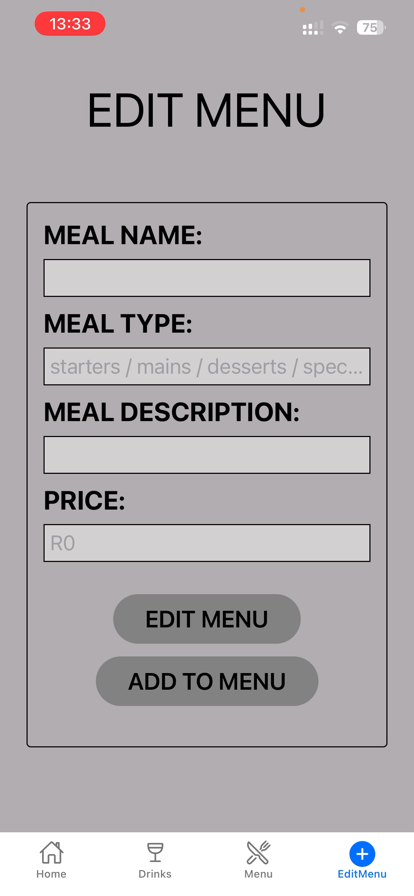
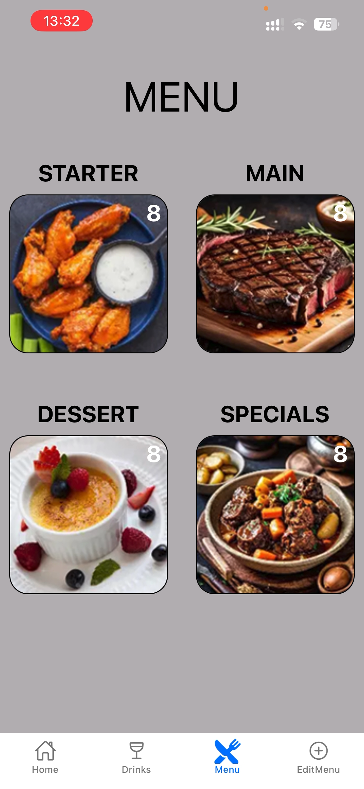
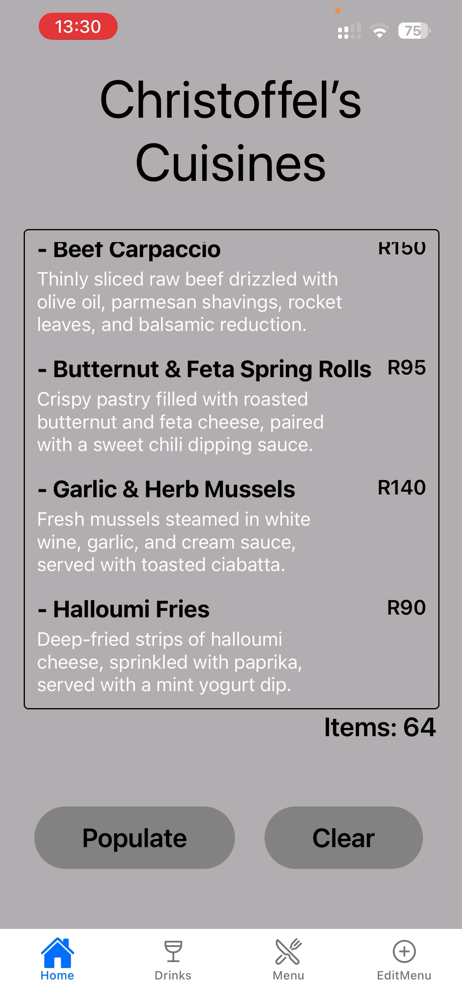

# Christoffel's Cuisines

## Description

Christoffel’s Cuisines is a modern, interactive food menu and ordering application built for restaurants to manage their dishes efficiently. The platform allows staff to update meal descriptions, prices, and categories with ease, ensuring customers always have access to accurate menu information.

## Features

- Fully dynamic menu with categories (Breakfast, Lunch, Dinner, Drinks, etc.)
- Edit meal descriptions and prices in real-time
- Filter meals by name and meal type
- Smooth navigation between main menu and subpages
- Responsive layout for mobile and desktop usage
- Clean, semi-professional dark theme design

## Installation

Clone the repository:

git clone https://github.com/yourusername/christoffels-cuisines.git

### Navigate to the project folder:

- cd christoffels-cuisines

### Install dependencies:

- npm install

### Run the application:

- npm start

### Open in your preferred browser or use Expo Go for mobile testing.

## Usage

- Navigate through the menu categories using the bottom navigation bar.
- Click on a meal to update its description or price.
- Only meals that match both the name and meal type will be updated.
- Subpages hide the main navigation for a cleaner interface; use the back button to return.

## Technologies Used

- React Native – For building the app interface
- TypeScript – Strongly typed code for safer updates
- Expo – Simplified mobile testing and deployment
- React Navigation – For smooth navigation between pages

## How It Works

Menu items are stored in an array grouped by meal type.

When a user updates a meal, the app searches for matching name and meal type.

Only the description and price are updated; other details remain untouched.

Changes reflect immediately across the app due to dynamic state handling.

## Contributing
### Contributions are welcome!

- Fork the repository
- Create a new branch for your feature (git checkout -b feature-name)
- Make your changes and commit (git commit -m "Add feature")
- Push to your branch (git push origin feature-name)
- Open a pull request

# Christoffel's Cuisines

## Description

Christoffel’s Cuisines is a modern, interactive food menu and ordering application built for restaurants to manage their dishes efficiently. The platform allows staff to update meal descriptions, prices, and categories with ease, ensuring customers always have access to accurate menu information.

## Features

- Fully dynamic menu with categories (Breakfast, Lunch, Dinner, Drinks, etc.)
- Edit meal descriptions and prices in real-time
- Filter meals by name and meal type
- Smooth navigation between main menu and subpages
- Responsive layout for mobile and desktop usage
- Clean, semi-professional dark theme design

## Installation

Clone the repository:

git clone https://github.com/yourusername/christoffels-cuisines.git

### Navigate to the project folder:

- cd christoffels-cuisines

### Install dependencies:

- npm install

### Run the application:

- npm start

### Open in your preferred browser or use Expo Go for mobile testing.

## Usage

- Navigate through the menu categories using the bottom navigation bar.
- Click on a meal to update its description or price.
- Only meals that match both the name and meal type will be updated.
- Subpages hide the main navigation for a cleaner interface; use the back button to return.

## Technologies Used

- React Native – For building the app interface
- TypeScript – Strongly typed code for safer updates
- Expo – Simplified mobile testing and deployment
- React Navigation – For smooth navigation between pages

## How It Works

Menu items are stored in an array grouped by meal type.

When a user updates a meal, the app searches for matching name and meal type.

Only the description and price are updated; other details remain untouched.

Changes reflect immediately across the app due to dynamic state handling.

## Screenshots
The following screenshots show key parts of the app UI:

## Links 
repository https://github.com/yourusername/christoffels-cuisines.git

Youtube https://youtu.be/qGS9_WJWTXc

## Contributing
### Contributions are welcome!

- Fork the repository
- Create a new branch for your feature (git checkout -b feature-name)
- Make your changes and commit (git commit -m "Add feature")
- Push to your branch (git push origin feature-name)
- Open a pull request

## Changelog

All notable changes to this project are documented here.

### [Unreleased]
- UX: Modals (Edit/Delete) improved — tapping outside a modal closes it and dismisses the keyboard.
- Feature: Home screen now shows newly added menu items immediately (without requiring "Populate"). When multiple items are added in a single operation, all newly added items are shown.
- Fix: Resolved JSX mismatches and small syntax issues introduced during modal and add-flow edits.
- Quality: Static checks and type checks executed during development; no TypeScript compile errors were present after the recent edits.

### [2025-11-12] - Working snapshot
- `EditMenuScreen.tsx`:
    - Added Delete button
    - Added Modal for EditMenu and for Delete button
	- Modal overlay handlers added to close modal on outside tap.
	- Keyboard dismissal behavior improved so tapping outside input boxes hides the keyboard.
	- Modal styles neatened (centered container, padding, rounded corners).
- `HomeScreen.tsx`:
	- Updated logic to detect newly added items and display them in the home input box instead of the full array (when appropriate).
    - Added averages for the meals
